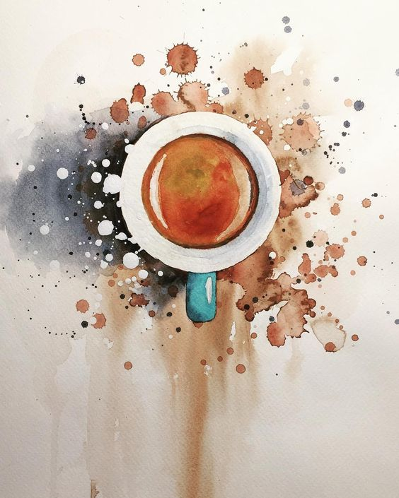



<h1 class="page-header text-center"></h1>

  <footer class="split-footer">
      <a href="/">Latest Posts</a>
      <i class="link-spacer"></i>
      <a href="/about.html">About</a>
      <i class="link-spacer"></i>
      <a href="/readinglist.html">Reading List</a>
  </footer>
  
    <article class="post">
      

        <h2><a href="{{ BASE_PATH }}{{ post.url }}">{{ post.title }}</a></h2>

        
{{ post.tagline }}

        

            <a href="author.html">Elyssa Macfarlane</a> <i class="link-spacer"></i> <i class="fa fa-bookmark"></i> {{ post.date | date_to_string }}
        

      

    </article>
  

